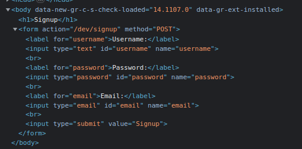
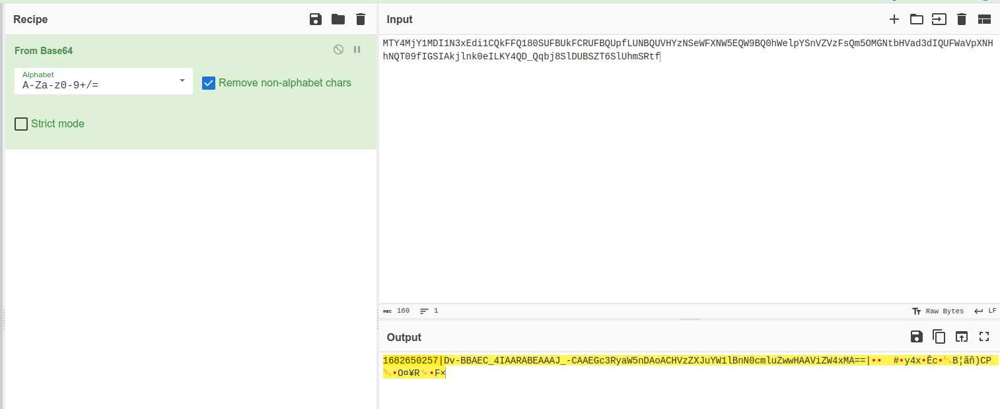
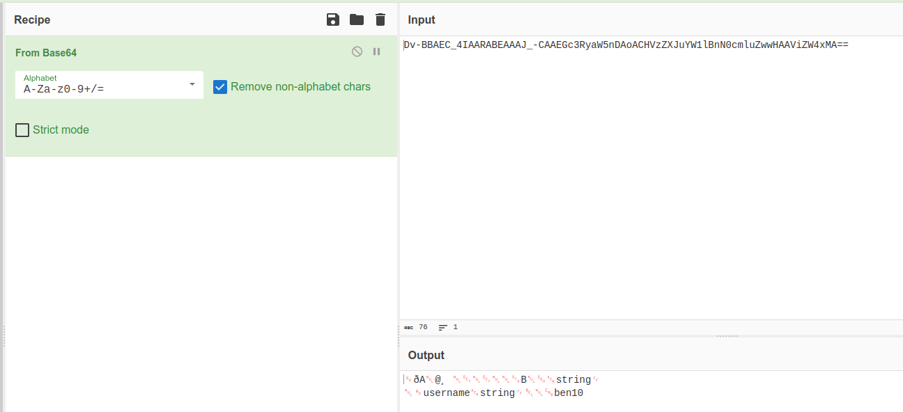

# Finals Challenge 1

The first challenge is to obtain an admin account on the website.

### Login Page
The challenge start with a login page url given, but no user credentials were provided.

- There is a link to signup page
- No cookies yet
- Just a simple html form with no other javascript or hidden fields

### Signup Page
The signup page is a simple form with username, password, and email. 

There does not seem to be any interesting fields to exploit. Thus, I attempted to create a new user, and login with it.

### Logged in as user
Upon successful login with the new user, I was presented with a profile page. Finally! There are some interesting findings. The page shows a `isAdmin` state with is currently false, and note "Flag: You are not an admin!!!". This means I need to find a way to set `isAdmin` to true.

### Failed attempt with cookies
After logging in, a session cookie was set. My immediate thought was to try to decode and modify the cookie to set `isAdmin` to true.

As the cookie data seems to be base64 encoded, I used cyberchef to decode it. I noticed there are 3 parts to the cookie data. The first part is a timestamp, followed by more base64 encoded data and some form of signature.

However, the payload had no indication of `isAdmin` value. I tried to modify the payload to change to username to `admin`, but the cookie was rejected by the server. This is likely due to the signature being invalid or the server does not actually have a default admin user.

### Adding `isAdmin` value to signup form
Based on the signup form HTML, I can understand that the server is expecting a `username`, `password`, and `email` key, and it sends the form data using a post request to `/dev/signup` endpoint.

I tried to add a `isAdmin` key to the form and see if the server accepts it. Since there was a hint given "If you tried 'true' and it did not work, try another value that is considered true in programming", I tried to add a `isAdmin` key with value `1` to the form.

Using an application like Postman, I can my custom form payload to the server. The server accepted the payload and created a new user.

### Logged in as admin
After logging in with the new user, I was presented with a profile page. This time, the `isAdmin` state is true, and the flag for the challenge is shown.

The page also shows information for the next challenge.