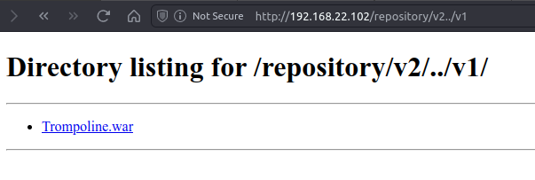

# Finals Challenge 2

The second challenge in about insecure nginx configuration with allowed for path traversal.

### Authentication Page
This challenge starts with `/repository/v2/` endpoint. This endpoint requires authentication. The credentials is provided after solving previous challenge.

### Repository Page
This page is a simple file directory listing. There is only one file `Notes.txt` in the directory.

### Notes.txt
The contents of the note is just a hint to the challenge, with says its something to do with "reverse proxy".

### Web Server recon
When trying `/repository` I got a 404 error. This also exposed the use of nginx as the web server software.

When going to the root path, it gives the default nginx page, further confirming the use of nginx.

Upon researching on common nginx misconfigurations, I found this article: https://book.hacktricks.xyz/network-services-pentesting/pentesting-web/nginx

### Path Traversal
Basing of the challenge description, the v1 folder should be found in the parent directory `/repository/`. However, the server is configured to only serve files from `/repository/v2/`. Thus, I need to find a way to bypass this restriction.

A way to bypass this restriction is to use path traversal. This is possible if niginx is poorly configured. By using `../` in the path, I can traverse to the parent directory.

Within the parent directory, I can see the `v1` folder. I can also see the `flag` file. After downloading the file, I can see the flag for the challenge.

The source code within the v1 folder is also available. This is likely the source code for a test website which will be used in the next challenge.

